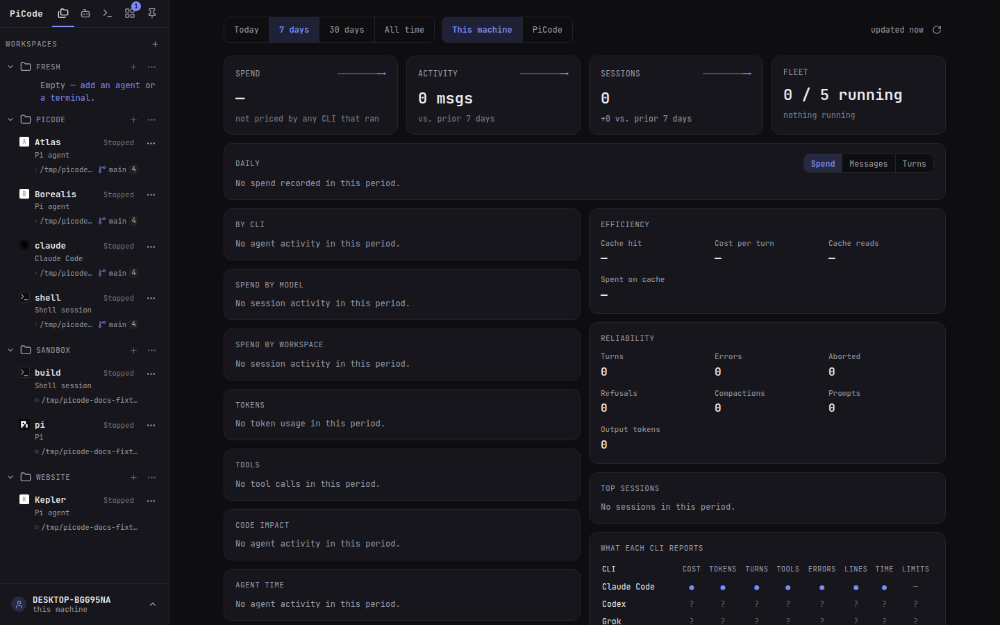

<p align="center">
  
</p>

<h1 align="center">PiCode</h1>

<p align="center">
  <strong>Run and supervise your coding agents from your browser — whichever CLI each one runs.</strong><br>
  Create agents, connect them to projects, watch their work and step in when
  they need you — from a desktop or a phone.
</p>

<p align="center">
  <a href="https://github.com/cfpperche/picode/actions/workflows/ci.yml"></a>
  <a href="https://cfpperche.github.io/picode/"></a>
  <a href="LICENSE"></a>
  
</p>

<p align="center">
  <a href="https://cfpperche.github.io/picode/guide/getting-started">Get started</a>
  ·
  <a href="https://cfpperche.github.io/picode/">Documentation</a>
  ·
  <a href="docs/architecture.md">Architecture</a>
</p>

> [!IMPORTANT]
> PiCode is pre-alpha. The core workflow is usable, but interfaces, storage
> migrations and installation paths may still change between releases.



## Why PiCode

Coding-agent CLIs — Pi, Claude Code, Codex, Grok, Hermes Agent, OpenCode,
Muse Code, Antigravity, Omp — each give a great terminal experience. A
terminal is also a hard place to supervise several long-running agents across
projects, especially when the person directing them does not live in a shell.

PiCode adds the orchestration layer: one browser workspace for creating,
configuring and steering a fleet of agents, whichever CLI each one runs. It
does not replace the CLIs: every agent is the real CLI process, and its
genuine TUI remains one tab away.

PiCode works with whichever of those CLIs you install; none is required, and
PiCode itself needs only tmux (ADR-0179); installing a CLI from Agent CLIs
uses Node.js and npm. An agent is a workspace or
free instance of any of them (ADR-0160). Pi is the one CLI that also has a
managed mode — structured chat and a composer over its own RPC (ADR-0091);
the others run their TUI in a PiCode terminal until they get a managed
adapter. **Agent CLIs** is the central manager for installs, launches,
sessions, providers, settings, packages and activity reporting.

**The browser is a door, not a cage.**

## What you can do today

| Capability | What it gives you |
|---|---|
| Agent fleet | Create free agents or attach several agents to a workspace, each with its own model, provider and working directory. |
| Chat and terminal | Use the CLI's own TUI in a tmux-backed browser terminal; Pi agents also get a structured conversation view. |
| Project tools | Browse and edit files, inspect diffs and Git history, manage sessions, and open persistent project terminals. |
| Agent CLIs | Configure installed CLI executables, arguments, environment, PATH and activity reporting; open, stop or restart individual terminals. |
| Human inbox | Collect questions, approvals and finished work in one place; reply without hunting for the right agent tab. |
| Automations | Start fresh agent runs on a schedule or webhook, with templates, limits and run history. |
| Desktop and phone | Supervise the same fleet through the desktop UI or the installable mobile PWA, with pairing and push notifications. |
| CLI ecosystems | Manage providers, packages, connectors and settings for every CLI while keeping each CLI's native files authoritative. |

PiCode is designed for solo developers running a few agents, terminal-averse
users who still want direct control, and teams hosting agents on a machine they
manage.

## What stays yours

PiCode is deliberately a thin layer over the tools and files you already own.

| Concern | Source of truth |
|---|---|
| Agent runtime | The CLIs you installed (`pi`, `claude`, `codex`, …); none is required |
| Conversations | Each CLI's own session files (Pi's under `~/.pi/agent/sessions/`) |
| Credentials and configuration | Each CLI's own auth, settings, package and extension files |
| Interactive processes | tmux sessions that survive browser and daemon restarts |
| Orchestration | PiCode's local SQLite database under `~/.picode/` |

If PiCode is not running, your sessions and configuration are still each
CLI's regular data. See the [architecture](docs/architecture.md) for the
full trust and persistence model.

## Quick start

The supported install is a GitHub release on Linux or WSL. Follow
[Getting started](https://cfpperche.github.io/picode/guide/getting-started):
install tmux, download `picode-linux-amd64`, run `picode install`, open
`https://localhost:8445`, then add the CLIs you use from **Agent CLIs**.
Windows uses [PiCode Desktop](https://cfpperche.github.io/picode/guide/windows-desktop).
A machine you reach from elsewhere uses
[On a server](https://cfpperche.github.io/picode/guide/remote-server).

### From source

To change PiCode, not to run it. Needs [Go 1.26+](https://go.dev),
[Node.js 22](https://nodejs.org) (the version used by CI) and tmux 3.5+.
The agent CLIs you want to run are installed afterwards, from **Agent CLIs**
in the app or with the vendor's command.

```bash
git clone https://github.com/cfpperche/picode.git
cd picode
make build
./bin/picode install
```

Open `https://localhost:8445`, add a workspace, create an agent, then
**Run**. Closing the browser does not stop the agent. `make cert` installs
a locally trusted mkcert certificate when you want the browser warning to
disappear. Full page: [From source](https://cfpperche.github.io/picode/guide/from-source).

The docs also cover [phone pairing](https://cfpperche.github.io/picode/guide/mobile)
and the [Chrome extension](https://cfpperche.github.io/picode/guide/browser-extension).

### Useful commands

| Command | Purpose |
|---|---|
| `make dev` | Run from the repository; run `make web` once on a fresh clone. |
| `make deploy` | Rebuild this checkout and restart the installed service. |
| `picode pair` | Print a one-time link for another browser or phone. |
| `picode update` | Download and verify a newer GitHub release. |
| `picode uninstall` | Remove the service; add `--purge` to delete `~/.picode`. |

## How it works

```text
Desktop browser / mobile PWA
            │ HTTPS + WebSocket + server-sent events
            ▼
┌─────────────────────────────────────────────────────┐
│ picode · one Go server                              │
│                                                     │
│ lifecycle · inbox · automations · files · event feed│
│             │                         │             │
│       tmux-backed PTY          JSONL RPC bridge     │
└─────────────┼─────────────────────────┼─────────────┘
              ▼                         ▼
   CLI TUIs (pi, claude, codex…)   pi --mode rpc (Pi only)
              └──── each CLI's own sessions and config ────┘
```

A Pi agent uses one live channel at a time, so the TUI and RPC view never
write the same session concurrently; every other CLI runs its own TUI in the
terminal PiCode gives it. The browser can disconnect without owning the
agent process. Details and trade-offs live in
[docs/architecture.md](docs/architecture.md) and the
[architecture decision records](docs/decisions/).

## Project documentation

- [Public documentation](https://cfpperche.github.io/picode/) — tutorials,
  guides, command reference and HTTP API
- Current project state — `make handoff` renders it from git, the open topics
  under `docs/handoff/open/` and the session notes
- [Architecture](docs/architecture.md) — components, protocols and security
- [Decision records](docs/decisions/) — the reasoning behind architectural
  choices
- [Release process](docs/release-process.md) — maintainer checklist for public
  releases (cadence proposal pending)
- [Engineering benchmarks](docs/benchmarks.md) — the product and quality bars
  used in review

## Contributing

Humans and coding agents work under the same repository contract. Read
[CONTRIBUTING.md](CONTRIBUTING.md) and [AGENTS.md](AGENTS.md) before making a
change. Pull requests keep code, tests, documentation, changelog and handoff in
sync.

## License

PiCode is open source under the [Apache License 2.0](LICENSE), at home and at
work. The installable CLI packages under `packages/` are MIT. Future paid team
features will live only under `ee/`; see [LICENSING.md](LICENSING.md).
