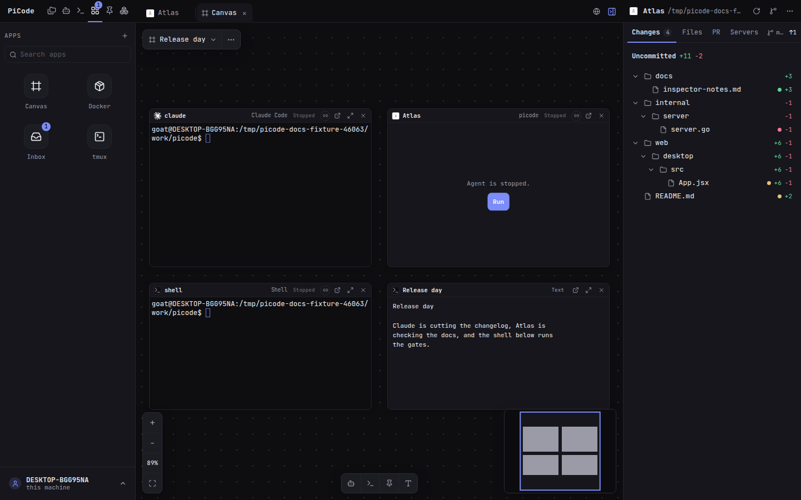

# Canvas

A **canvas** is one plane that shows many agents and terminals side by side,
live. Each tile is a **panel**: the real screen of that agent or terminal —
the same one its own tab shows. A panel can also hold a **pinned note**,
**text you write on the plane**, a **file**, or the **changes** to a file —
so the plan you are working from and the code you are changing sit beside
the work.

- **Where:** **Apps** tab → **Canvas**.
- **Not this:** not a screenshot of the tabs, and not the sidebar list of agents. Each panel is the live screen.

Canvases are saved on the server, so every browser signed in to your PiCode sees the same ones.

## Make one

1. **New canvas** in the **⋯** menu, give it a name.
2. At the bottom of the plane there is one button per thing a canvas holds:
   **agent**, **terminal**, **pin**, **text**. Press one.
3. **Draw the rectangle** where you want it, at the size you want. A single
   click puts one there at its usual size.
4. For an agent, a terminal or a pin, pick which one from the list that
   opens — anything already on this canvas is not offered again. A **text**
   panel has nothing to pick: it appears where you drew it, ready to type in.

<kbd>Esc</kbd>, or pressing the same button again, cancels before you draw.

You choose where every panel goes. Nothing is placed for you, which matters
on a plane that has no edges: a panel put somewhere by the app would as
likely land off the side of what you are looking at.

Top left, the surface names the canvas you are on and opens a menu of the
others. The **⋯** beside it renames or deletes the one you are looking at,
and is where **New canvas** lives. Deleting a canvas never touches the
agents and terminals on it.

An empty canvas draws nothing at all — the plane and the toolbar are the
whole page.

### Text panels

**Text** writes on the canvas itself: a label beside a terminal, a note to
whoever opens it next, the sentence that says why three agents are sitting
together. It saves as you pause and when you click away, and everyone
looking at that canvas sees it. Two thousand characters — a **pin** is what
holds longer writing, and a pin panel shows one with its title and tags.

### The controls, and hiding them

The bottom edge carries the toolbar in the middle, the zoom column on the
left and the minimap on the right. **Right-click the plane** for the canvas
menu; its first row, **Show controls**, takes all three away so the plane is
only the plane. The right-click still works with them hidden — that is how
you bring them back.

## Move around it

Panels sit wherever you put them, on a plane you pan and zoom.

- **Move** a panel by dragging its header.
- **Resize** it from any corner or edge.

| To | Do |
|---|---|
| move around | drag with the middle or right mouse button, or hold <kbd>Space</kbd> and drag |
| zoom | the mouse wheel, or the **−** and **+** buttons in the corner |
| see everything at once | **Fit**, or press <kbd>0</kbd> |
| move several panels together | drag a box around them, then drag any one of them |
| find your way | the minimap in the corner shows the whole plane and where you are on it |
| lay them out again | **Tidy panels** in the **⋯** menu, or in the right-click menu |

**Tidy panels** puts them back in reading order — three across, left to
right — and keeps every panel the size you made it. Nothing on a canvas
moves on its own: that is what the plane is for, so tidying is something
you ask for rather than something that happens to you.

The layout saves itself as you go, for everyone. If someone else changed
the same canvas while you were dragging, PiCode reloads it and says
*Canvas changed elsewhere — reloaded.*

### Where you are looking is yours

The place and the zoom you left the canvas at are remembered in **this
browser only**, and come back the next time you open that canvas. Two
people — or the same person on a laptop and a desktop — can look at
different corners of the same canvas without pulling each other around.
Where the panels *are* is shared, as it always was: moving a panel is an
edit, moving your view is not.

### Zoom, and why typing needs 100 %

How far out you are decides what a panel can do.

| Zoom | The panel |
|---|---|
| **100 %** | a live terminal you can read, type in **and click in** |
| 80 – 150 % | still live, still takes your typing, but clicks are switched off |
| below 75 % | the text of the last screen it had, frozen, with the header still live |
| below 40 % | a name-plate: face, name and status, sized to stay readable |

The one rule to know: **a click inside a terminal only lands where you
aimed it at 100 %**. Away from 100 % the terminal works out which
character you clicked from the wrong measurements and picks the wrong one —
and PiCode passes clicks through to the program running inside, so a
mis-aimed click reaches your editor or your CLI, not just the browser.
Nothing on screen would look wrong, so the panel simply stops taking
clicks: clicking it takes you back to 100 % first, and the click after that
lands where you meant. The percentage under the zoom buttons does the same in
one press.

Below 75 % a panel disconnects and shows its last screen instead. That is
what lets a canvas hold hundreds of panels: only the ones you are close
enough to read are connected. Zoom back in and the same terminals come
back exactly where they were.

## What a panel shows

The header always carries the name, the workspace or the CLI, and the same
word the sidebar uses — **Working**, **Needs you**, **Ready** — even when
the panel's body is asleep.

| The panel is bound to | The body shows |
|---|---|
| a running terminal | the live terminal, ready to type in |
| a pin | the note, formatted and read-only |
| a file | the editor, with **Save** — the same one its tab has |
| the changes to a file | the diff, kept up to date as the file changes |
| a stopped CLI terminal | *This CLI terminal is stopped.* — the conversation a Resume would reopen, then Resume last session / Start from Agent CLIs |
| an agent working in its terminal | its live screen |
| a managed agent | its conversation, live and read-only — the same turns, tools and answers its tab shows |
| a stopped agent | *Agent is stopped.* — Run |
| something that was deleted | *That terminal is gone.* — Remove |

**Open** in a panel's header sends you to that agent or terminal's own tab.
The screen follows you there and comes back when you return to the canvas —
there is only ever one of it. On a note the same button opens **Pin
Studio**, which is where a note is written; the panel picks the change up
as soon as you save it.

### A managed agent's conversation

A panel bound to a managed agent shows what it is saying, as it says it —
the same turns, tool cards and answers you would read in its tab, scrolling
itself as the agent writes. You read here; you **answer in the tab**. The
panel has no message box, no queue buttons and no way to reply to a
question, so nothing you click by accident can reach the agent.

**When the agent is waiting on you**, the chip turns to **Needs you** and
the panel shows the question with the choices it is offering, above a line
across the bottom of the body that names it and gives you **Open**. Open
takes you to the agent's tab, where you answer. The chip is the same one the
sidebar shows, so a panel says *Needs you* even when its body is asleep or
the canvas is zoomed too far out to read — which is the point: you can see
which of twenty agents is blocked from across the whole plane.

A conversation costs a live connection, so the canvas only keeps the ones
you can actually read: panels far from what you are looking at are put to
sleep, panels below 40 % zoom become name-plates, and if more than twelve
conversations are in view at once the ones you scrolled past longest ago say
*Paused* until you come back to them. Nothing is lost — the conversation is
read again from the start when the panel wakes up.

Notes, files and diffs are not terminals, so the rules that exist for
terminals do not apply to them: they take your clicks and your scrolling at any zoom, and
stay readable down to 40 %, where — like everything else — they become
name-plates.

**A file or diff panel only shows a file you already have open in a tab.**
The picker lists those and nothing else: it is not a file browser, and it
never goes looking through your folders. Open the file the way you always
do, then add it here — as the file, as its changes, or both. **Unsaved changes are safe**: the panel says *Unsaved*, it is
never put to sleep while it holds them, and maximizing it keeps your text.
Removing the panel asks first.

## Link two panels

A **link** between two panels is you saying: *these two sessions may send
each other messages.* Drawing one is the whole gesture — hover a panel, and
a small round connector appears at the right of its header; drag it onto
another panel.

**What a link does, exactly.** The two sessions gain each other as a
**contact** in PiCode's messaging (the same thing the **Messages** page sets
up for a folder). One can send the other a message and read the replies,
and that is all.

**What a link never does.** It does not let one session read the other's
history — not its transcript, not its scrollback, not its session file, not
what you typed into it. Those often hold file contents, command output and
credentials, and reading is copying: once a session has copied another
one's log, no amount of removing the line could take it back. If one agent
needs to know what another found, it asks — and the other answers in its own
words, with its own judgment about what to share.

**PiCode will always ask first.** Drawing a line never connects anything
quietly:

- If one of the two is not connected yet, you are offered the connection in
  one line, with what it grants. Cancel and nothing at all is written — no
  link, no connection.
- If the two work in **different project folders**, you are asked again,
  separately, and the question names both folders. Two sessions in the same
  folder can already message each other with no link at all; a link across
  folders is the one thing that is genuinely new, so it gets its own yes.

**Removing a link takes the permission with it.** Click the small chip on
the line (or select the line and press <kbd>Delete</kbd>) and confirm. There
is nothing left over: PiCode works out who may message whom from the lines
that exist right now, so the moment a line is gone, so is the permission.
Deleting either panel, or the whole canvas, does the same.

**A link that is not working says so.** It turns amber, is marked **Broken**
and tells you why when you point at it — *"Cleo's connection was revoked;
the link grants nothing"*, *"Delta's session changed; the link grants
nothing"*. A broken link grants nothing at all; it is not a faded version of
a working one.

Only **agents** and **Agent CLI terminals** can be linked. A note, a file or
a diff has no mailbox, so those panels have no connector.

A line can be off the screen, hidden behind the two panels it joins, or too
small to point at, so each panel's header also shows a small chip with how
many links it has — amber if any of them is broken. The chip opens the list
below.

### Read every link in one place

**Agent CLIs → Messages** ends with **Canvas links**: every link you have
drawn, anywhere, with both ends, which canvas it lives on, whether it is
working right now, and a **Remove** that revokes it exactly as the canvas
does. It is not filtered by the folder picker above it — links across two
folders are precisely the ones you want to see — so this page is the
complete answer to *"which of my sessions can reach which?"*

## Keyboard

Click a panel's header once (or press <kbd>Tab</kbd> into the canvas) to
select it. Then:

| Key | Does |
|---|---|
| <kbd>←</kbd> <kbd>→</kbd> <kbd>↑</kbd> <kbd>↓</kbd> | move to the panel next door, bringing it into view |
| <kbd>Home</kbd> / <kbd>End</kbd> | first / last panel |
| <kbd>Enter</kbd> | go to 100 % and start typing in this panel's terminal, in one press |
| <kbd>Shift</kbd>+<kbd>Esc</kbd> | stop typing and come back to the panel |
| <kbd>Delete</kbd> | remove the panel from the canvas (with **Undo**) |
| <kbd>+</kbd> / <kbd>-</kbd> | zoom in / out |
| <kbd>0</kbd> | fit every panel on screen |

Arrow keys bring an off-screen panel into view; a panel already on screen
is left where it is, so the plane never jumps under you.

Inside a panel every other key belongs to the program running there — a
plain <kbd>Esc</kbd> reaches it, which is why leaving takes
<kbd>Shift</kbd>+<kbd>Esc</kbd>.

## One panel, full width

The **Maximize** button in a panel's header — the diagonal arrows, next to
the × — gives that panel the whole surface. The rest of the canvas keeps its
layout underneath and the panel's slot says *Shown maximized*. The terminal
resizes to the bigger space, so more of it fits. The same button, now
**Restore**, puts it back; from the keyboard that is
<kbd>Shift</kbd>+<kbd>Esc</kbd> to leave the terminal, then <kbd>Esc</kbd>.

## Limits, and why

| | |
|---|---|
| 64 canvases, 500 panels each | a canvas is meant to feel unbounded; the cap keeps one page's load honest |
| smallest panel: 256 × 224 pixels | anything narrower is too cramped for a terminal to be readable |
| zoom from 20 % to 150 % | further out than 20 % nothing resolves, even a name; further in the panel is bigger than the screen |
| 1000 links per canvas | a link is a permission you drew by hand; a thousand of them is already more than anyone can audit |
| only panels near what you are looking at stay connected | each live panel is a real connection to a real terminal; the rest show their last state in the header and wake up when you reach them |

Panning past a panel does not connect it — it has to stay in view for a
moment first. That is why a fast trip across a hundred panels costs
nothing.

## On a phone

The Apps list shows the Canvas tile as **Desktop only**. A plane of live
terminals needs a pointer and a wide screen; on a phone, open the agent or
terminal you need from the sidebar instead.
