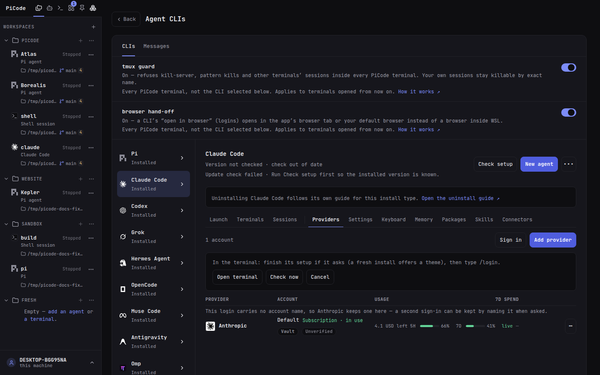
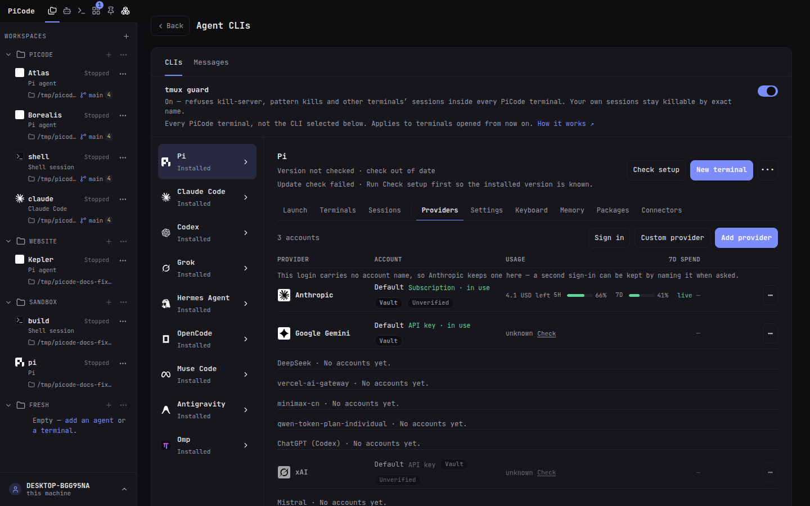

# Providers

Accounts apply to this machine. Everything PiCode saves here lives in one
encrypted vault: `~/.picode/credentials.json` next to the key that opens it
(`credentials.key`). Keys are never shown again after save.

- **Where:** **Agent CLIs**, pick a CLI, then **Providers** — `#/clis/pi/providers`
  for Pi, `#/clis/codex/providers` for Codex, and so on for Claude Code,
  OpenCode, Grok, Hermes, Muse, Antigravity and Omp.
- **Not this:** not [Connectors](/guide/mcp) and not [Settings](/guide/settings). Older Providers links redirect here.

Pi keeps its own file (`~/.pi/agent/auth.json`) and PiCode reads and writes
exactly that, like the pi TUI. Canonical:
[pi Providers](https://github.com/earendil-works/pi/blob/main/packages/coding-agent/docs/providers.md).

## One pane, every CLI

All nine CLIs share one Providers pane (`Agent CLIs` → pick a CLI →
**Providers**), with the same columns and the same words: the account's name,
who it is, its **Usage** windows and what your sessions spent on that provider
in the last 7 days. Which CLIs appear where, and what each action does, is
below.

## Sign in

**Add provider** (or `/login`) → pick a provider. This is pi's own door: the
login runs through pi, and the key or token lands in `~/.pi/agent/auth.json`.

| Method | In PiCode |
|---|---|
| API key | All providers that accept a key |
| Account | Claude, Codex, Copilot, Kimi, xAI |
| Either | Claude, Kimi, xAI, OpenRouter, … |

Account login opens a browser tab (Claude, Codex) or shows a device code (Copilot, Kimi, xAI). Radius account login stays in the TUI (needs a gateway URL).

**Add account** keeps extra logins in the vault. pi still sees **one** active
slot in `auth.json` — **Use** copies that login into the slot. Two agents
cannot use two Claude logins at the same time (pi limitation).

**Pause** keeps a login but takes it out of play. The credential stays; the
account stops being offered. Pausing the one you are using promotes another;
the last live account cannot be paused — that is **Sign out**.

Sign out says what it breaks: the confirm names the agents and automations
configured on that provider.

## The same pane for the other CLIs

Claude Code, Codex, OpenCode, Grok, Hermes, Muse, Antigravity and Omp keep the
same pane for the providers they can use. They carry every column pi has,
including **Usage** and **7d spend**, wherever the vendor and the account allow
it — plus the five actions that belong to a CLI whose login is its own file:

| Action | What it does |
|---|---|
| **Sign in** | opens a terminal running that CLI's own login (its binary, its browser or device-code flow). **Open terminal** takes you straight to it; finish the login there, press **Check now**, and the account appears above |
| **Import** | reads the login that CLI already has on this machine and stores a copy in the vault. The CLI's own file is never changed, and nothing is activated by importing |
| **Add provider** | stores a key for a provider this CLI can use — or starts the CLI's own guided sign-in when the provider supports one |
| **Verify** | spends exactly one listing call to the provider with the stored key — the button says so — and remembers the answer with its age |
| **Use** | writes that account into the CLI's own login file, so the CLI runs on it — the same thing **Use** does for Pi |
| **Sign out** | removes that account from the vault |

Signing in a **second** account works wherever the CLI's own file says who the
account is (Codex, Grok, Hermes, Antigravity): you get two rows and **Use**
switches between them. Claude Code and Muse keep no name in their file, so
PiCode asks you to name a second login; with a name, the next sign-in is kept
beside it instead of on top of it. Accounts in the vault are unaffected by
naming, and the CLI's file still holds one login at a time.

## Adding a second account

The pane looks like this — the bar on top, and one row per account under its
provider:

1. **Sign in**. PiCode opens a terminal running that CLI's own login — the
   vendor's binary, the vendor's OAuth. **Open terminal** takes you straight
   to it.
2. Sign in with the **other** account there. Two things trip people up:
   - A CLI on its first run opens on its own setup (Claude Code offers a
     theme before anything else). Finish that and you reach its prompt.
   - A CLI that is already signed in — like Claude Code above — has **no
     login screen**. Type `/login` (pi, Claude Code, Omp) or run the login
     subcommand again (`codex login`, `grok login`…) and **sign out of the
     current account in the browser first**, or use a private window —
     otherwise the vendor approves the same account you are already using.
3. **Check now**. PiCode reads the CLI's file: a different token becomes a
   new row. Where the file carries no account name, the pane offers two
   doors: **Name and add** (type a name — that name is what keeps the two
   apart from now on) or **Keep both** (the login already saved keeps its
   own row, named from what PiCode knows about it).
4. **Use** switches the CLI between the accounts, one at a time.

pi's pane adds its own doors, with Usage and 7d spend on every row:

**Add provider** signs in through pi itself (OAuth in a window — no terminal)
and **Custom provider** adds a gateway pi does not know. See
[Custom provider](#custom-provider).

**Use** never changes where the CLI keeps its state: no new folder, no
`HOME`-style variable, nothing about settings, sessions or memory moves. It
replaces one file — the CLI's own login file — and PiCode keeps a copy of what
was there the first time it writes (the path is shown when it happens).

Two rules come with that:

- **One account per CLI is live at a time.** Switching affects terminals you
  open afterwards, and only one login can sit in the file. Running two accounts
  of the same CLI side by side would need a separate home per account, which
  this deliberately does not do.
- **Use is refused while a terminal of that CLI is running** (the refusal says
  how many). Replacing a credential under a running agent is how sessions get
  corrupted.

Some limits are the vendors', not PiCode's, and the pane says so on the row:

- **Omp** keeps its accounts in its own database, which PiCode does not read.
  Its pane manages API keys; a subscription login stays with Omp.
- **Muse Code** and **Antigravity** keep their login somewhere PiCode does not
  write, so their panes list what exists here and name what they cannot do.
- When a login carries no account name (Claude, Muse, Antigravity), PiCode
  keeps **one** subscription login per provider — the pane says so on the row.
- A subscription login that a CLI renews by itself has only one live copy on
  the machine. When the CLI renews its tokens, PiCode **harvests the renewal
  back into the saved row** on the next look — Verify and Usage keep working
  without a re-import. If you **Use** a stale copy anyway, the pane warns
  before writing: that login may ask for a fresh sign-in.

## Custom provider

**Custom provider** (in pi's and Omp's Providers panes) opens a page that adds
a gateway the CLI does not know out of the box — OpenRouter-style aggregators, prepaid wallets,
self-hosted routers. The form asks for a name, the base URL, the API key and
the model ids exactly as the gateway spells them. Use lowercase letters,
digits and dashes for the name — it becomes the provider id.

| CLI | Definition | API key |
|---|---|---|
| Pi | `~/.pi/agent/models.json` — pi's own provider definitions | `~/.pi/agent/auth.json` — the same file as every other sign-in |
| Omp | `~/.omp/agent/models.yml` — omp's own provider definitions | inside the definition (`apiKey`) — the only place a custom Omp provider can carry one |

For Pi the key is never written into the definition. For Omp the definition
and its key are one row: **Edit provider** reopens the form (a blank key keeps
the saved one), **Remove provider** deletes both, naming what still uses the
provider. Hand-edited entries are preserved in both files: PiCode merges by
name and never touches providers it does not own. Overriding a built-in
provider's URL is not offered here.

The Advanced section offers each CLI what it actually reads: Pi carries the
full compatibility set (including the stream-usage flag, chat-template
objects and per-model thinking levels); Omp carries its own smaller set —
the same two compatibility flags, its five thinking formats, and per-model
name, limits, input and cost.

Model ids must match the gateway exactly — use **Load models** to copy them
from the gateway's own list. The API type select covers
OpenAI-compatible (Chat Completions or Responses), Anthropic-compatible
(those gateways want a base URL without `/v1`) and Google gateways.

Canonical: [pi Custom Models](https://github.com/earendil-works/pi/blob/main/packages/coding-agent/docs/models.md),
[omp models.yml](https://github.com/can1357/oh-my-pi) (`docs/models.md` in the package).

## Where a login comes from

A provider you never signed into here can still be signed in: if its API-key
environment variable is set, pi reads it. Those rows say so, named by the
variable (`GROQ_API_KEY`), and have no Sign out — change the variable, not
this page.

## Verify

**Verify with pi** in a row's ⋯ menu asks pi whether it could use that
provider right now (`pi auth check`). It costs nothing: no model call, no
token, and an expired login is reported rather than refreshed.

The other CLIs verify differently — one listing call to the provider, named on
the button, on each of their account rows — because those CLIs have no
equivalent command.

## Usage

Claude, Codex, Copilot, Kimi and xAI rows signed in with an **account** show
plan windows. ZAI, OpenCode Go, OpenRouter and MiniMax show them for an
**API key**. A provider without a plan meter shows none. This is the same for
every CLI: the window belongs to the account, not to the tool that holds it, so
a Claude subscription imported from Claude Code shows the same numbers as pi's.

The windows are on the row itself:

| What you see | What it means |
|---|---|
| A bar and **live** | fetched within the last few minutes |
| A bar and **12m old** | the same number, that old. Click it to re-check |
| **not checked** | never fetched on this machine. Click **Check** |
| **sign in again** | the login expired |
| **no plan windows** | this provider publishes no quota |
| An amount, such as `$4.10 left` | a balance, not a percentage. It has no ceiling to draw a bar against |

PiCode refreshes only the **active** account of each provider, every few
minutes. Everything else is fetched when you ask. The numbers are the
provider's own; nothing here is estimated from your session.

**Usage** opens the full dialog: every window, the reset times and banked
resets. If Codex or Grok has one, **Redeem** spends that credit (you confirm
first) and clears the current window.
