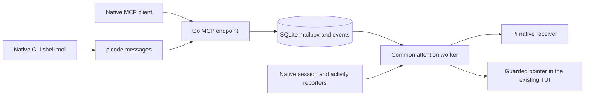

# Direct session communication (ADR-0104, ADR-0106, ADR-0107)

> Part of [PiCode's architecture](../architecture.md). Edit this subsystem file; the index only links.

`internal/communication` serves four tools through the official Go MCP SDK at
`/mcp/communication` in the existing Go server. `picode messages contacts|send|read|ack`
is a client of those same tools. Both paths share SQLite, authorization, workspace
isolation, request deduplication and acknowledgement. There is no separate daemon,
agent engine or orchestration queue. Terminals keep their native TUIs in tmux;
managed Pi keeps its RPC runtime.

Owner routes: `GET/POST /api/communication`, `DELETE /api/communication/{id}`,
`GET /api/communication/{id}/messages?before=`. Desktop and mobile each own their
Messages view under `#/clis/messages[/<kind:ownerId>]`. Both subscribe to `peer.*`,
owner changes and feed reconnect/reset. Owner history reads never acknowledge.
A live status describes the process; it does not certify an attached MCP client.

`peer_connections` binds a hashed credential to a managed agent's session file
or a terminal's native session ID, CLI and workspace. Every operation validates
that binding in its transaction. An unrevoked native conversation reserves one
owner's address even while that owner temporarily shows another conversation;
resuming cannot resurrect duplicate addresses. Replacing/disabling revokes the
old credential. This is local capability authorization, not hostile-process
attestation. The bearer is required even with browser authentication disabled,
passes the Host/Origin gate and cannot authorize owner APIs.

Automatic Pi, Claude Code and OpenCode setup uses their existing MCP
integration. Managed Pi checks its session before adapter registration; terminal
setup attaches only to an exact resume recipe. Private launcher directories are
0700 and credential files 0600. SQLite keeps only the hash. Local HTTPS validates
the certificate with an additive private CA bundle; no global trust change occurs.
OpenCode preserves other inline JSON keys and MCP servers; JSONC inline merging
is refused.

Grok, Hermes and Codex use their native shell tool to invoke `picode messages`. The tool's
current `GROK_SESSION_ID`, `HERMES_SESSION_ID` or `CODEX_THREAD_ID` selects one private
connection on every call. No conversation bearer is inherited from Grok's shared
leader or Hermes' cached MCP process. Missing, conflicting or ambiguous identity
fails before network access. An explicit private connection file supports other
local clients; inside a native Grok/Hermes/Codex conversation it must match that ID.

Grok's native hooks and Hermes' native plugin report identity and activity.
The launcher installs credential-free, receipted integration files, preserving
unrelated native files and refusing edited integration files. Hermes resolves the
selected/sticky profile through its own `config path` command and enables the
plugin without tool-override permission. Native files are inert outside PiCode.
No HOME overlay, Python monkeypatch or replacement of the native executable is
used. Native reports bind to a live wrapper incarnation and ordered session
sequence; identity and activity publish together. After server restart, a report
can recover its wrapper only when PID ancestry matches the current pane and no
other wrapper owns the lease. Grok/Hermes and enrolled connections never change
identity through cwd/latest-session discovery. A TUI that has never emitted a native lifecycle event remains unobserved.

`peer_messages` is the durable inbox and history. Exact request retries return
the same receipt; conflicting content fails. Read is non-consuming. Ack validates
the entire batch before writing. `peer.connection`, `peer.message`, `peer.ack`
and `peer.attention` commit with their mutations and carry IDs, not message bodies.
History survives revoke/restart, cascades with owner deletion, and has explicit
capacity refusals.

Attention is separate from delivery and acknowledgement. One feed-driven worker
selects the oldest pending message per current recipient; a three-second tick
also observes local terminal edits, which do not enter the browser feed. It
persists `pending → attempted` before touching a process, then records `notified`
or `uncertain`. A crash in `attempted` never causes an automatic repeat.
Pi uses the existing native receiver with the original session file and an
attention-only idle/draft check immediately before native submission. Other
terminals require the exact live session/run/pane and a recognized empty composer,
then recheck before paste and before Enter. Unknown layouts, drafts, permission
prompts and absent observations retain pending mail. The tmux boundary cannot
atomically lock a native editor: observed races stop submission, leave text in
place and report uncertainty. PiCode never clears a draft to make room. A pointer
contains no sender-controlled body and is not evidence that a model read the mail.

Grok input recognition supports both its plain composer and the bordered composer
observed in Grok Build 1.0.25. The latter requires matching frame width, a single
empty input row, cursor position, model border and shortcut footer. Before claiming
an attention attempt, its full pointer must fit on one line; a narrow pane keeps
the message pending. The same fit and identity checks run again before Enter.
Regression coverage: [Grok input validation](../plans/grok-communication-input.md).

Decision table and native acceptance: [execution plan](../plans/unified-native-messages.md).

Grok attention waits for its final native idle notification (about a minute),
not its continuation-capable Stop hook. Child completion and delayed teardown
cannot repin its conversation. OpenCode verifies root-session metadata and
selects a conversation through a native user-message hook or exact connected
resume; background session activity cannot replace it.

## Workspace onboarding (ADR-0110)

`peer_participants` stores explicit owner/workspace/CLI consent with a revision.
Selection updates are atomic; stale revisions fail and disabling revokes every
owner capability in the same transaction. The attention worker reconciles this
intent against native session identity. New conversations receive fresh setup;
unknown identities never mint a capability. Setup stays in the existing Go
process and uses the same feed and native input tick.

`GET /api/communication/workspaces` returns participants, preparation, current
connections and diagnostic results. Workspace-scoped `/participants` (PUT),
`/open` and `/test` (POST), and `/history` (GET) support the normal flow.
Desktop/mobile independently own workspace views at
`#/clis/messages/workspace:<id>`; the former owner route resolves its workspace.
The former per-conversation manager is available under Advanced.

Grok/Hermes/Codex resolve prepared setup in their native shell calls. Pi initial setup
and hot replacement share one receiver-owned MCP registration; setup uses the
receiver's exact-session, idle, pending-message and editor guards. Additive TLS
trust uses Node's per-process default CA API (validated on Node 24). Receiver
hello updates are ordered and readiness is bound to the current process/run.
Managed reconnect is an explicit action: an RPC command/queue fence checks the
native idle session before joining the old writer and resuming the stored file.

Other native MCP CLIs use the recorded resume recipe. Preparation rechecks the
live session, run, pane, native state and full empty composer before stopping.
The replacement preserves the captured pane width and height before browser attachment.
A private shutdown receipt retains exact PID/start tokens across daemon restart;
all captured writers must exit before any replacement launch. The receipt is
outside the conversation credential directory so revocation cannot erase it.
Non-Linux replacement refuses until equivalent process ownership is available.

`peer_checks` records owner-requested native diagnostics. The sender receives a
short native attention prompt; its authenticated `read_messages` output may
include `connection_check`. Only a correlated send/reply with both explicit
acknowledgments passes. There is no backend impersonation. Submission is claimed
before writing, uncertain attempts never retry, revoked sessions cancel, and
missing proof expires after five minutes. Active checks remain visible beyond
the 100-result history window. Native tool permissions and model capacity apply.

Decision table and evidence: [onboarding plan](../plans/communication-onboarding.md).

Codex's native `SessionStart` hook is accepted as an identity report. Readiness
still waits for an actual native event; startup before the first user turn is
not assumed or verified on every CLI version. A compaction start remains Working
rather than authorizing input. Hook semantics follow the
[vendor reference](https://developers.openai.com/codex/hooks).

Codex uses the native message client without an enrollment restart (ADR-0111).
Its SessionStart hook supplies command discovery as native developer context.
Per-tool thread aliases must agree, and a PiCode terminal identity must match
its connection owner. Legacy terminals can resolve the same private directory
from their PiCode data root. After a modern hook is observed, legacy completion
notifications cannot overwrite that run's session or activity.

OpenCode returns its plugin before querying any instance-dependent API. An exact
resume candidate is verified against native root metadata, then a one-time native
status query publishes readiness after initialization. A newer native event wins
over the snapshot; missing metadata, failed status and child sessions report no
readiness. No startup API request is awaited by plugin initialization or by the
event queue. Claude recognizes the native single-line mode footer and the compact
three-line footer ending in `/rc`; unknown footers and drafts remain blocked.
Regression table: [resume repair](../plans/communication-resume-repair.md).

Grok's empty bordered composer may display an unaccepted native suggestion.
The input guard recognizes only its captured dim-and-italic text, empty cursor,
complete frame and exact `Tab/→:accept suggestion` footer together. Typed or
partly accepted text, a changed cursor/frame/footer and copy mode still refuse
automatic input. Native identity, Idle, approval and exact post-paste pointer
checks remain independent requirements. Regression: `TestPeerGrokNativeSuggestion`.

### Restart recovery (ADR-0112)

The common native hook writes a private, ordered observation before HTTP, so
reports survive daemon downtime. The existing presence watcher validates its OS
boot ID, process start token, wrapper run, CLI and exact pane before rebuilding
live identity/activity. The original Working age is retained. Missing or invalid
records stay unknown; last-session pins never prove an active conversation.
The private lock retains the ordering/source fence before checkpoint publication.
Both must agree; a failed newer write cannot expose an older Idle. A failure to
retain the fence blocks that incarnation until a fresh wrapper start.
Attention checks that the disk observation still agrees before the existing
native input guards. Pi receiver presence renews within five seconds, independently
of activity. This recovery currently requires Linux/WSL process metadata.

Messages shows activity and connection separately. Pending identification uses
Syncing / Reconnecting, native approvals use Needs your input, and only preparation
errors use Connection failed. Historical Test passed is separate from readiness.
Enabled unavailable owners remain visible in the test selectors; selecting them
never redirects a test to another participant.

Hermes uses native root session/turn IDs for activity and its message-command
context. Its standard pre-tool hook scopes the session environment to one plain
`picode messages` command; background review helpers, other turns and compound
shell commands cannot inherit that repair. Native permissions still apply. This
avoids a vendor background helper's process-global identity replacing the open
conversation. Loading this adapter change requires resuming the native CLI once.
