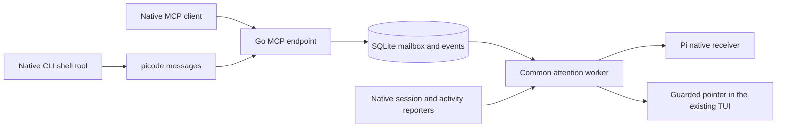

# Direct session communication (ADR-0104, ADR-0106, ADR-0107)

> Part of [PiCode's architecture](../architecture.md). Edit this subsystem file; the index only links.

`internal/communication` serves four tools through the official Go MCP SDK at
`/mcp/communication` in the existing Go server. `picode messages contacts|send|read|ack`
is a client of those same tools. Both paths share SQLite, authorization, workspace
isolation, request deduplication and acknowledgement. There is no separate daemon,
agent engine or orchestration queue. Terminals keep their native TUIs in tmux;
managed Pi keeps its RPC runtime.

Owner routes: `GET/POST /api/communication`, `DELETE /api/communication/{id}`,
`GET /api/communication/{id}/messages?before=`. Desktop and mobile each own their
Messages view under `#/clis/messages[/<kind:ownerId>]`. Both subscribe to `peer.*`,
owner changes and feed reconnect/reset. Owner history reads never acknowledge.
A live status describes the process; it does not certify an attached MCP client.

`peer_connections` binds a hashed credential to a managed agent's session file
or a terminal's native session ID, CLI and workspace. Every operation validates
that binding in its transaction. An unrevoked native conversation reserves one
owner's address even while that owner temporarily shows another conversation;
resuming cannot resurrect duplicate addresses. Replacing/disabling revokes the
old credential. This is local capability authorization, not hostile-process
attestation. The bearer is required even with browser authentication disabled,
passes the Host/Origin gate and cannot authorize owner APIs.

Automatic Pi, Claude Code, Codex and OpenCode setup uses their existing MCP
integration. Managed Pi checks its session before adapter registration; terminal
setup attaches only to an exact resume recipe. Private launcher directories are
0700 and credential files 0600. SQLite keeps only the hash. Local HTTPS validates
the certificate with an additive private CA bundle; no global trust change occurs.
OpenCode preserves other inline JSON keys and MCP servers; JSONC inline merging
is refused.

Grok and Hermes use their native shell tool to invoke `picode messages`. The tool's
current `GROK_SESSION_ID` or `HERMES_SESSION_ID` selects exactly one private
connection on every call. No conversation bearer is inherited from Grok's shared
leader or Hermes' cached MCP process. Missing, conflicting or ambiguous identity
fails before network access. An explicit private connection file supports other
local clients; inside a native Grok/Hermes conversation it must match that ID.

Grok's native hooks and Hermes' native plugin report identity and activity.
The launcher installs credential-free, receipted integration files, preserving
unrelated native files and refusing edited integration files. Hermes resolves the
selected/sticky profile through its own `config path` command and enables the
plugin without tool-override permission. Native files are inert outside PiCode.
No HOME overlay, Python monkeypatch or replacement of the native executable is
used. Native reports bind to a live wrapper incarnation and ordered session
sequence; identity and activity publish together. After server restart, a report
can recover its wrapper only when PID ancestry matches the current pane and no
other wrapper owns the lease. Grok/Hermes and enrolled connections never change
identity through cwd/latest-session discovery. A TUI that has not emitted a
native lifecycle event remains unobserved.

`peer_messages` is the durable inbox and history. Exact request retries return
the same receipt; conflicting content fails. Read is non-consuming. Ack validates
the entire batch before writing. `peer.connection`, `peer.message`, `peer.ack`
and `peer.attention` commit with their mutations and carry IDs, not message bodies.
History survives revoke/restart, cascades with owner deletion, and has explicit
capacity refusals.

Attention is separate from delivery and acknowledgement. One feed-driven worker
selects the oldest pending message per current recipient; a three-second tick
also observes local terminal edits, which do not enter the browser feed. It
persists `pending → attempted` before touching a process, then records `notified`
or `uncertain`. A crash in `attempted` never causes an automatic repeat.
Pi uses the existing native receiver with the original session file and an
attention-only idle/draft check immediately before native submission. Other
terminals require the exact live session/run/pane and a recognized empty composer,
then recheck before paste and before Enter. Unknown layouts, drafts, permission
prompts and absent observations retain pending mail. The tmux boundary cannot
atomically lock a native editor: observed races stop submission, leave text in
place and report uncertainty. PiCode never clears a draft to make room. A pointer
contains no sender-controlled body and is not evidence that a model read the mail.

Decision table and native acceptance: [execution plan](../plans/unified-native-messages.md).

Grok attention waits for its final native idle notification (about a minute),
not its continuation-capable Stop hook. Child completion and delayed teardown
cannot repin its conversation. OpenCode verifies root-session metadata and
selects a conversation through a native user-message hook or exact connected
resume; background session activity cannot replace it.
