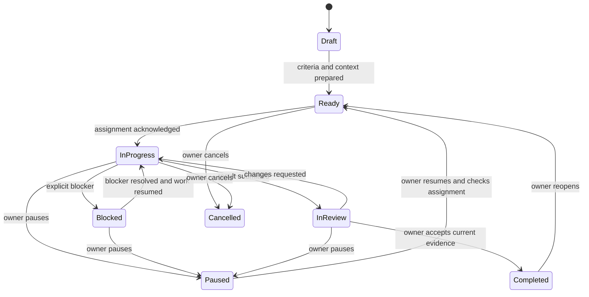

# Missions — persistent work across agents and sessions

Status: **proposed for owner review**, 2026-09-23. This document plans a new
feature; it neither implements it nor accepts its architectural decisions.
Repository inventory: `4f2a44c16` on `main`. Recheck the touched subsystems
before each implementation branch.

## 1. Product outcome

A person gives PiCode an outcome, follows its progress, answers decisions and
reviews the result. The mission retains the objective, acceptance criteria,
decisions, evidence and next action when an agent stops or a different CLI
takes over. Its identity and history outlive any individual agent.

Primary user: one person supervising several coding agents across projects.
The first release should reduce repeated explanations and forgotten follow-ups.
It must work with interactive CLI agents; Pi managed mode is optional.

Example: "Add password recovery, make it usable on a phone, test it and prepare
it for review." The owner records the acceptance criteria, assigns an agent,
answers a question in Inbox, transfers the mission if necessary, and reviews a
specific result. A second agent can later review the same mission and return
findings without losing its history.

## 2. What already exists, and the actual gaps

| Existing capability | Reuse | Gap Missions must address |
|---|---|---|
| [Agent identity](../decisions/0160-cli-runtimes-are-agents.md) | One agent identity for every launchable CLI | A durable work item independent of agent deletion and session rollover |
| [Session handoff](../architecture/cli-session-handoff.md) | Readers, capability discovery, preview, native import, deterministic brief and lineage | Mission context and responsibility; Continue in currently leaves the source running |
| [Inbox](../architecture/agent-manager.md) | Questions, replies, notifications and phone reachability | Correlation with a mission and its exact assignment; resolving an item must not imply task completion |
| Checklists (`internal/store/checklists.go`) | Display the executor's current steps | Acceptance criteria and history must survive checklist replacement and agent removal |
| [Delivery](../architecture/delivery.md) | Revision-bound declarations, evidence, review and integration governance | Link the requested outcome and its criteria to one or more deliveries |
| [Change feed](../architecture/change-feed.md) | Transactional events, replay, reset and client refetch | Mission events and a durable timeline independent of the feed's seven-day retention |
| [Automations](../architecture/automations.md) | Scheduling and existing delivery channels | Unattended creation still starts Pi managed agents; do not assume a general runner exists |
| [Messages](../architecture/direct-session-communication.md) | Existing identity and provenance lessons | A mission assignment is not a new peer-contact or transcript-access grant |

Inspect `internal/server/cli_handoff.go`, `agent_fork.go`, `agent_prompt.go`,
`term_prompt.go`, `automations_run.go`, `internal/store/delivery.go`,
`internal/mcptool/delivery.go` and the shared client before implementation.

### Benchmark adaptation

Official documentation inspected on 2026-09-23; no competing product was run.
These are documented patterns, not evidence that competitors lack Missions.

| Reference | Pattern and proposed PiCode adaptation |
|---|---|
| [Cursor Cloud Agents](https://cursor.com/docs/cloud-agent) | Isolated execution and review artifacts: associate every result with its working folder and evidence; preserve PiCode's installed CLI runtimes |
| [t3code source control](https://github.com/pingdotgg/t3code/blob/main/docs/user/source-control.md) | Persistent links between threads and pull requests: link mission, native sessions and deliveries without copying provider state |
| [Paseo worktrees](https://github.com/getpaseo/paseo/blob/main/public-docs/worktrees.md) | A workspace owns the task's working files: show the checkout and use isolation when another writer is present |

Follow [PiCode's UX bars](../benchmarks.md#uiux-benchmarks) and the
[delivery study](../benchmarks/2026-09-21-delivery-governance.md). The older
[benchmark adoption](../benchmarks/2026-08-24-adopt-t3code-paseo-cursor.md) is
historical; its Pi-only assumptions have since changed under ADR-0160/0179.

## 3. First release and subsequent expansion

The MVP is complete only after milestones M1–M3. It includes:

- A mission in one workspace, with title, objective, acceptance criteria,
  context references, decisions and one explicit next action.
- One active executor per mission and one active mission assignment per agent.
  Other sessions remain linked as history. Assignment to an existing agent is
  sufficient; creating an agent uses the existing creation flow.
- Owner-initiated start, pause, resume, transfer, review, acceptance and cancel.
- A context preview for transfer, durable checkpoints, visible delivery
  uncertainty and recovery after a process or daemon restart.
- Desktop creation/review and mobile status, replies, pause and review access.
- An agent reporting contract available through the CLI and optional MCP;
  manual owner updates remain usable when an agent cannot call it.
- Evidence per acceptance criterion and links into Delivery and native sessions.

Missions in folders without Git can track research or documentation outputs.
Code delivery evidence requires a repository and a revision. Git, a provider
account and a paid model are not prerequisites for creating a mission.

Later milestones add a separate reviewer, then dependent stages and bounded
automation. Automatic CLI selection, cross-workspace execution, unattended
provider failover, automatic merge/deploy, arbitrary transcript indexing and
automatic rollback are outside the first release. They are future candidates,
not permanent refusals.

## 4. User flow and surface

1. **Create mission.** Choose a workspace, describe the outcome and add criteria.
   Context can include selected files, session references and an existing
   delivery. Keep advanced fields collapsed.
2. **Assign and start.** Choose an agent and working folder. Preview the task
   that will be sent. If launch or sending needs user action, open that exact
   step and retain the draft. Show separately that it was submitted and that
   the mission was acknowledged.
3. **Follow and answer.** Show the next action, latest checkpoint and any named
   blocker. A question opens the existing Inbox flow with a link back here.
4. **Transfer.** Preview the objective, accepted decisions, attempts, files,
   evidence, remaining work and explicit omissions. Confirm the source has
   stopped writing before another executor uses its working files.
5. **Review.** Show each criterion beside its evidence and the revision reviewed.
   Return findings to the same mission or accept the result. Integration uses
   Delivery's existing owner-controlled flow.

Proposed host routes: `#/missions` (workspace filter and compact list) and
`#/mission/:id` (detail). Enter from the workspace and command palette. This is
a core work surface, with a mission link beside its assigned agent. Validate
the exact navigation placement in M0; no new dashboard of summary cards.

Detail order: objective and state; primary next action; criteria and evidence;
context and decisions; activity history. Desktop may keep list and detail
together; mobile uses a list followed by a focused detail page. Both share
headless contracts and feed handling, with independent app chrome (ADR-0072).

| State on screen | Copy and action example |
|---|---|
| Empty list | "No missions in this workspace." → Create mission |
| No executor | "Choose an agent to start." → Choose agent |
| Waiting for a decision | The actual question → Answer |
| Source still writing | "The current agent is still working." → Open agent |
| Uncertain submission | "Receipt not confirmed." → Check agent |
| Disconnected | "Connection lost. Showing the last update." → Reconnect |
| Missing source artifact | "This evidence is no longer available." → Replace evidence |
| Review available | "Ready for your review." → Review result |

Reuse tokens, Zod schemas, `PageFrame`, responsive dialogs/mobile sheets and
existing controls. Preserve the last result during refetch; use skeletons for
initial load and visible progress for preparation/transfer. Optimistic edits
roll back on failure; sending, acceptance and transfer only become confirmed
after the server confirms them. No invented percentage of completion.

## 5. State, evidence and authority

The diagram shows the main path; cancellation is available from every
nonterminal state, including Draft and Paused. `Completed` and `Cancelled`
are terminal until an explicit reopen. Archive is a visibility flag on a
terminal mission and does not delete its history or working files.

Three independent facts must remain visible: **mission lifecycle**, **agent
activity**, and **delivery/integration status**. Agent idle/exit and completed
checklists never establish mission completion. Submitted evidence is labelled
as agent-reported, observed by PiCode, or accepted by the owner.

Each criterion has a stable ID and evidence references. Review binds to an
immutable scope/criteria version and a result revision or artifact digest.
Changing that scope or code invalidates pending acceptance; an accepted
snapshot remains historical and is not silently rewritten. Work can be
accepted before integration; integrated/deployed are separate observations.
For code, MVP acceptance requires a committed candidate revision and a clean
candidate worktree. Observe both HEAD and working-file changes: an unchanged
commit ID does not establish unchanged code. Non-Git outputs use an artifact
digest. Unavailable evidence blocks acceptance until replaced or the owner
explicitly revises the requirement and starts a new review.

Pause prevents further mission dispatch. It requests interruption through
the existing channel only when that channel supports it and the owner chose
it. Show "Pause requested" while a process is still running. Cancellation
closes future mission work, records whether the process stopped, and preserves
files. Neither action implies rollback.

## 6. Proposed implementation boundaries

Use the existing Go server, SQLite store and feed; no new runtime or queue
dependency is proposed. Suggested ownership, with names finalized in M0:

| Component | Responsibility |
|---|---|
| `internal/store/missions.go` and migrations | Mission metadata, criteria, assignment generations, checkpoints, references, action receipts and durable history |
| `internal/mission` | Lifecycle rules, context assembly and reconciliation with existing launch/prompt/handoff services |
| `internal/server/missions.go` | Owner API and identity-checked agent actions over the same domain contract |
| `cmd/picode/mission.go`, `internal/mcptool/mission.go` | CLI and optional MCP adapters; no duplicated business rules |
| `web/shared` | Schemas, client, domain state and feed reducers |
| Desktop and mobile mission views | Each app's presentation and navigation |

The logical records are Mission, Criterion, Assignment, Checkpoint, Evidence
Reference and Action Receipt. A mission stores stable workspace/repository
identity as well as a display snapshot. An assignment records agent, native
session when known, working folder, role, generation and start/end reason.
Mission-owned records cannot cascade away when an agent, session, Inbox item
or workspace is deleted; missing references become explicit unavailable rows.

Mutations require the expected version and a request ID. Commit the mutation,
its durable history and feed event in one transaction. Exact retries return
the same receipt; reusing an ID with a different payload fails. Store and
transport tests cover both mutation-event invariants from ADR-0048.

Proposed agent verbs: `show`, `context`, `report`, `block`, `attach-evidence`,
`request-review`. The owner assigns, transfers, edits acceptance criteria,
pauses, cancels, reopens and accepts. An agent may propose scope changes in a
report; it cannot accept its own result or change its assignment.

Agents operate only on their current server-resolved assignment and generation.
Native session identity is checked where available. A bare client-supplied
mission ID grants nothing. Reuse the existing launch attribution model and
state its same-user limits: this does not sandbox an agent's filesystem access.
Mission tools need an explicit catalog/launch setting and parity across their
CLI/MCP adapters; they do not depend on Messages being enabled.

### Context and transfer

The default context packet is deterministic: goal, current criteria, owner
decisions, attributed checkpoints, relevant reference metadata, blockers and
next action. It has a version/digest and an omissions list. AI summaries may
be proposed later but are never silently authoritative. Preview selects what
travels; transcript excerpts and file contents require explicit selection.
Credentials, environment values and hidden reasoning are not collected.

Store bounded text snapshots in PiCode's data directory/database. References
retain provenance, revision/digest and observation time; a link to a screenshot
or log is not a promise to preserve that file forever. Managed copies, if
offered, need explicit size/retention rules in M0. Context text is data, not
permission to execute embedded instructions or contact other agents.

Transfer is a durable operation: prepare → verify source quiescence → reserve
the next assignment → launch/send → acknowledge. Each external effect has a
receipt and reconciliation state. Close the old assignment before granting
write responsibility to the new one. A crash may leave an unconfirmed launch;
inspect identity/receipts and offer recovery rather than launch or paste again.
An assignment generation rejects late reports from the former executor; it
cannot itself stop that executor writing files.

Reuse session handoff where its capabilities fit and link its lineage. Its
existing "source remains running" behavior stays valid for ordinary Continue
in; Missions adds its own controlled transfer path. For an existing target
agent, deliver the context through its supported prompt flow. For a fresh
target, use the existing creation/handoff flow and bind it only when identity
is known. Unsupported combinations keep a copyable brief and an explicit
manual acknowledgement, without claiming automatic delivery.

Keep the existing checkout when a quiescent source hands over unfinished files.
If work must proceed concurrently, require another worktree and an explicit
commit/patch handover; creating a worktree does not copy uncommitted changes.
Prepare/run Git actions through the existing doors and busy interlock
(ADR-0078/0096). Do not create a hidden service-side Git mutation path.

### Inbox and Delivery

Correlate an Inbox item with the mission, assignment generation and captured
session while keeping the existing agent/terminal reply provenance. Acceptance
actions originating in Missions execute its owner transition; reading or
dismissing a generic Inbox item never accepts a mission. Deduplicate
notifications by mission/action version. A stale answer stays in history and
is not silently forwarded to a new executor.

Link Delivery IDs and evidence through their existing readers. A transferred
mission does not change the author of an existing delivery: ADR-0171 gives
mutation authority to its original principal. A new executor creates its own
declaration for its revision and links it; the old declaration stays history.
Any future reassignment of delivery authorship needs an explicit amendment.

## 7. Decision table and required coverage

All rows are planned behavior, **not tested implementation**. M0 assigns each
row to a milestone test. A milestone cannot claim a row passed on prose alone.

| ID | Conditions | Required action | Gate |
|---|---|---|---|
| D01 | Same request ID and same payload retried | Return original receipt; no duplicate mutation, question or execution | M1/M2 |
| D02 | Stale version or reused ID with different payload | Conflict; preserve current state and editable draft | M1 |
| D03 | Agent becomes idle, exits, or completes its checklist | Update observations only; no inferred acceptance | M1/M2 |
| D04 | Caller has no assignment, wrong role/session, or old generation | Refuse mutation; do not fall back to another identity | M2 |
| D05 | Source still writing or quiescence unknown | Hold transfer; show the source and next action | M2 |
| D06 | Source quiescent, target supported, preview current | Reserve once, dispatch once where provable, acknowledge exact assignment | M2 |
| D07 | Send/launch outcome unknown after timeout or crash | Keep uncertainty; reconcile; no blind retry or second writer | M2 |
| D08 | Target unavailable, unauthenticated or unsupported | Preserve packet and source history; offer setup/manual continuation | M2 |
| D09 | Daemon/browser restarts during work | Restore mission; re-observe runtime; no automatic fresh execution | M1/M2 |
| D10 | Pause/cancel while process is still active | Block future dispatch; display pending stop truthfully; preserve files | M2 |
| D11 | Required evidence missing, failed or for another revision | Keep review unresolved; record fixes or an explicit owner scope revision | M3 |
| D12 | Criteria and result match, evidence sufficient, owner accepts | Record immutable acceptance snapshot; no implicit merge/deploy | M3 |
| D13 | Code/scope changes after review opens or mission is accepted | Invalidate pending acceptance; retain historical acceptance and require reopen for new work | M3 |
| D14 | Old Inbox answer after transfer | Preserve answer provenance; request explicit disposition before reuse | M3 |
| D15 | Agent/session/workspace/artifact is removed | Retain mission and history; block unavailable actions; explicit valid relink | M1/M3 |
| D16 | Delivery was authored by the previous executor | Read/link it; new executor cannot mutate or inherit its author grant | M3 |
| D17 | Dirty source files and a different target worktree | Require explicit file/commit transfer; do not imply files were copied | M2 |
| D18 | Reviewer requests changes | Record findings and return to execution; reviewer has no completion authority | M4 |
| D19 | Automatic stage retry or resume with unmet prerequisites/limits | Refuse dispatch; retain named blocker and consumed budget | M5 |

## 8. Delivery milestones

| Milestone | Scope and dependencies | Acceptance gate |
|---|---|---|
| **M0 — settle the contract** | Confirm this scope; inspect current adapters; prototype list/detail/transfer; write proposed ADRs and map D01–D19 to tests | Owner approves boundaries; every action has a source of truth, capability rule and recovery behavior |
| **M1 — persistent mission** | Store, API, feed, criteria, history and desktop/mobile shell; explicit assignment metadata; depends on M0 | Create/edit/reload/restart without loss; concurrent edits conflict; deletion preserves history; empty/error states visually accepted |
| **M2 — execute and transfer** | Reporting CLI/MCP, start/pause/resume, checkpoints, context preview, transfer and crash reconciliation; depends on M1 | Real Codex → Claude Code transfer in one repository, same-CLI new-session recovery, Pi optional; no duplicate writer under D05–D10/D17 |
| **M3 — review and close the loop** | Inbox correlation, criterion evidence, Delivery links, owner acceptance, mobile review and pilot; depends on M2 | End-to-end mission from request to acceptance with one question, one transfer and one rejected/stale review; **MVP release gate** |
| **M4 — separate reviewer** | Sequential reviewer assignment and findings; explicit role changes; depends on accepted MVP | Reviewer returns evidence-linked findings; executor fixes; owner accepts current result; reviewer is advisory, with no assumed filesystem sandbox |
| **M5 — dependent stages and bounded automation** | Explicit dependency graph, supported runner capabilities, pause/recovery, concurrency/retry/time budgets; depends on M4 and a separately approved CLI-neutral unattended runner | Dependencies, cycles, limits and restart replay tested; unavailable execution/cost controls remain explicit |

Each milestone is split into small branches with one coherent reviewable
change. M1–M3 are a medium-sized project touching persistence, lifecycle,
tooling and both web apps. Reuse reduces work but does not make reliable
handoff a one-screen change. Produce a calendar estimate after M0's adapter
matrix and prototype; the milestones above are acceptance commitments, not
unmeasured dates.

M2 initially validates Codex and Claude Code as the owner's concrete transfer
path, plus managed/interactive Pi regression coverage when installed. All nine
CLIs can be represented through the common agent identity. Publish a measured
per-CLI capability matrix for launch, prompt receipt, context read, checkpoint
report, interrupt and resume; unsupported automation remains unavailable with
a reason. Two passing adapters do not establish nine passing adapters.

## 9. Decisions to approve and dependencies

Recommended product baseline: Missions is a host feature; one workspace and
executor per mission; owner acceptance; deterministic context; M1–M3 first.
UI labels and canonical repository content use English; "Missões" is the
Portuguese name used in the product discussion.

Two boundary decisions should be drafted during M0, with ADR numbers allocated
by `make adr` only in their implementation/design branch:

1. **Mission persistence and protocol:** ownership, lifecycle, versioned
   criteria, durable history, receipt idempotency, deletion/retention and
   the shared CLI/MCP contract.
2. **Mission execution and transfer:** assignment/session attribution,
   source quiescence, context access, Inbox correlation, restart recovery and
   the exact exceptions/extensions to ADR-0088/0089/0107/0154.

ADR-0091's managed-runtime boundary remains in force as refined by ADR-0160.
MVP does not depend on the pending ACP decision. The general unattended runner
belongs to M5 and needs its own current capability evidence and approval.
ADR-0170/0171 and ADR-0182/0186 remain the source of truth for delivery evidence,
author identity and integration. Provider-mode queue execution still has
unfinished work in Delivery; mission review must not depend on it finishing.

M0 also fixes text/artifact capacity limits, export/retention behavior and the
navigation placement. Safe proposed default: archive retains bounded mission
text and receipts; artifact references may expire visibly; no automatic purge
of working folders, user sessions or unrelated files.

## 10. Validation and success measures

Use disposable scratch workspaces for lifecycle and crash fixtures. Store/API
tests cover versions, grants, events, deletion and D01–D19 as each milestone
lands. Test the real installed CLIs for the capabilities claimed, including
busy targets, unconfirmed submission, authentication failure and restart.
Native-session evidence identifies the CLI version and source/target session.

Desktop and mobile visual review covers empty, active, blocked, disconnected,
transferring, failed and review states. Inspect screenshots in a subagent,
exercise keyboard/focus, preserve drafts and run the overlay audit. Physical
phone/Windows behavior needs owner evidence when it cannot be exercised here.

Use `make ci-scoped` while iterating, `make close` before landing, and `make ci`
on main. Architecture docs, public help, changelog and a session handoff travel
with each delivered slice. Planning documentation is not feature delivery;
deployment remains the owner's separate action.

Proposed pilot: five real missions in the owner's workflow after M3, including
a cross-CLI transfer, an interrupted session, a rejected review and a decision
answered from a phone. Record the sample and outcomes locally.

| Measure | Initial acceptance target |
|---|---|
| Lost mission history or duplicate executor caused by recovery | Zero across the pilot and fault fixtures |
| Accepted without current evidence or owner acceptance | Zero |
| Transfer usable without retyping the objective/decisions | At least four of five transfer trials; report every omission |
| Time spent re-explaining context and locating next actions | Compare with five baseline tasks before Missions; use observed minutes, not an invented productivity claim |
| UI clarity | Owner can identify responsible agent, blocker and next action from the mission detail |

If reliable receipt and safe transfer cannot be demonstrated, keep the explicit
manual handover and record the unsupported combinations. Do not advance to
automatic coordination until the MVP's continuity promise is established.
