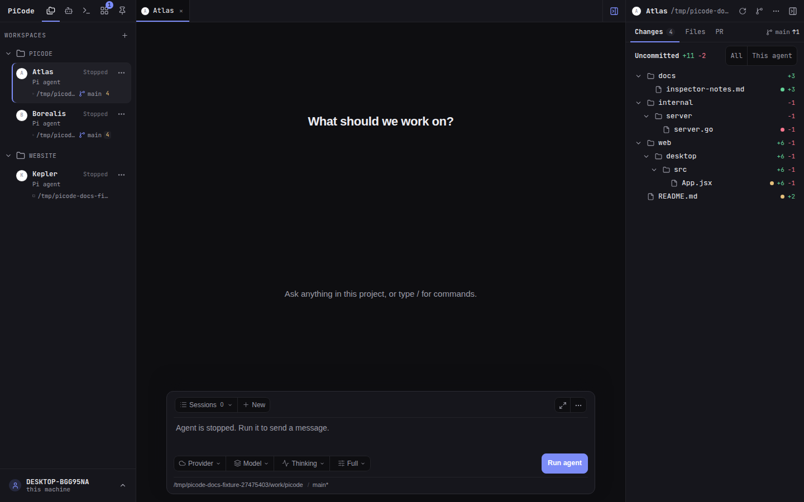

# Files and changes

Click the folder path below an agent or terminal, or the folder button on a
workspace, to open its File Tree. The desktop keeps one tab per folder.

Select a file in **Files** to display its content in the panel on the right.
Selecting another file replaces that panel. Images and supported documents
have previews; text files use the editor. Markdown and SVG offer **Preview**
and **Raw**, and **Save** writes your edits. You can also press **Ctrl+S**
(**Command+S** on macOS).

**Changes** lists files changed since the latest commit. Select an item to
review its diff, then choose **Open file** to inspect or edit its current
contents in the same panel. **View diff** returns to the comparison. Deleted
files have a diff but no current file to open.

Switching **Files / Changes** keeps the detail open. Drag the divider to adjust
the tree's width, or focus it and use the arrow keys. In the tree, Up/Down moves
focus, Right expands a folder, Left collapses it or focuses its parent, and
Enter opens the focused item. Closing the detail gives the tree its full width.

If you have unsaved edits, replacing the file, opening a diff or closing the
File Tree asks you to **Save**, **Discard** or **Cancel**. A failed save keeps
your draft visible. If another process changed the file, **Reload** asks before
discarding your edits and reading the new contents. Switching to another
PiCode tab keeps your draft and reading position.

**Refresh** updates the file list and changes. Automatic refreshes preserve
unsaved text. If a terminal moves to another folder, the open File Tree asks
for an explicit refresh before using that folder. Return the terminal to the
original folder to save an existing draft there, or discard it before moving on.

**Reveal** opens the folder in the file manager on the machine running PiCode.

## The Inspector

The desktop keeps a rail on the right of the conversation or terminal. It
follows the agent, terminal or workspace behind the selected tab and shows two
lists. **Changes** groups the working tree by folder, with lines added and
removed beside each file and each folder, the total at the top, and the
current branch. Beside an agent, **This agent** narrows the list to the files
that agent's tools edited. **Files** is the project tree, with a filter over
the folders you have opened.

Selecting a change opens that file's diff as a tab in the center; **Open file**
switches the tab to the editor and **View diff** brings the comparison back.
Selecting a file opens the editor directly. The rail itself never edits.

**PR** shows the pull request for the current branch, read through the
GitHub CLI (`gh`) that is already logged in on the machine running PiCode:
number, title, state, review decision, checks, lines changed, and a link to
open it on GitHub. When the branch has no pull request, **Create in terminal**
types `gh pr create --fill` into your terminal for you to review and submit.
If `gh` is not logged in, **Log in from a terminal** types `gh auth login` the
same way. PiCode never stores a GitHub token and never creates a pull request
on its own. Answers are kept for a minute; **Refresh** asks GitHub again.

The branch name beside the tabs shows how far it is from its upstream
(`↑2 ↓1`), or says *unpublished* when it has none. The **Git actions** menu in
the rail's header prepares Fetch, Pull, Push, Commit, Commit and push and
Create pull request: each one types the exact command into a terminal of that
folder, reusing an idle one or opening a new one, and leaves it for you to
press Enter. Commit asks for a one-line message and shows the command it will
prepare. Your shell, your credentials and your hooks do the work, in a
terminal you can see.

The menu's last item, **Run when no agent is working here**, lets PiCode press
Enter for you. It does so only when no agent in that repository is in the
middle of a turn, no automation is running there, and no other terminal there
is working or has a program in the foreground. Otherwise the command is left
ready in the terminal and a note tells you who is busy. The choice is
remembered in your browser and is off by default.

If a terminal moves to another folder, the rail keeps what it showed and says
so; **Follow** reads the new folder. **Refresh** rereads the current one. The
menu offers **Reveal folder**, **Open git graph** and **Open as tab** (the File
Tree described above).

Drag the rail's left edge to resize it, or focus the divider and use the arrow
keys. The button at the right end of the tab strip, **Ctrl+.** (**Command+.** on
macOS) or the command palette hide and show it. On windows of 1440px or wider
it starts open; it narrows before it hides and steps aside whenever the
conversation would get less than 640px.

