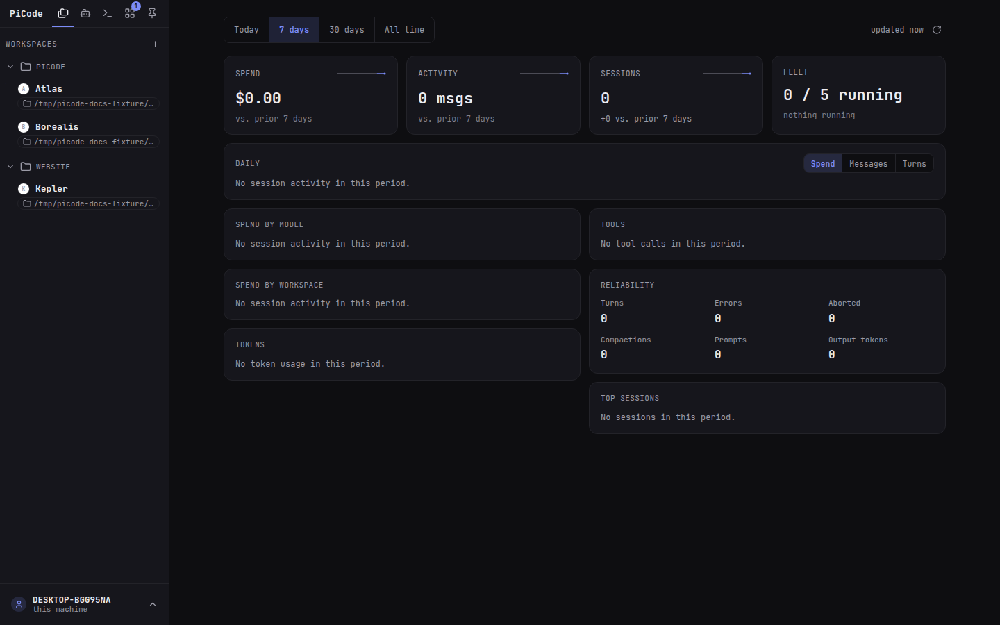

# Getting started

Requires [Go 1.22+](https://go.dev), [Pi](https://www.npmjs.com/package/@earendil-works/pi-coding-agent), tmux 3.5+.

```bash
git clone https://github.com/cfpperche/picode.git
cd picode
make build
./bin/picode install    # systemd --user; starts when this Linux session starts
```

Open `https://localhost:8445`. The sidebar has a tab per kind: **Agents** (agents without a project), **Workspaces** (your project folders — each card holds its agents and terminals, and its buttons create them right there), **Terminals** (loose shells) and **Pins**. Add a workspace, add an agent inside it (or a free agent), then click **Run**. Close the browser tab; the agent keeps running.



`make deploy` rebuilds this repo and restarts the service. `picode update` checks GitHub for a newer release. `picode uninstall` removes the service. `--purge` also deletes `~/.picode`.

```bash
make dev          # run from the repo without installing
```

Green padlock: `make cert` (mkcert). See the [README](https://github.com/cfpperche/picode#quick-start) for TLS and bind details.

To send the tab you are looking at to an agent, load the Chrome extension.
Guide: [Chrome extension](/guide/browser-extension).

Personal use is free under PolyForm Noncommercial. Company use needs a [commercial license](/license).
