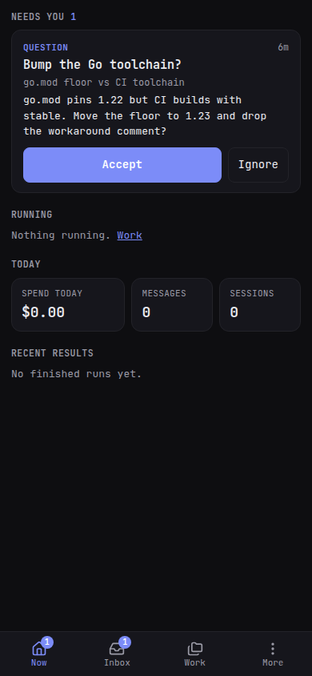
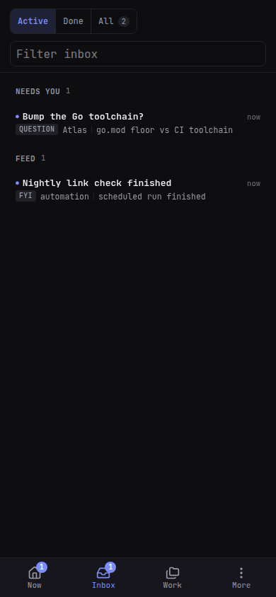

# PiCode on your phone

Open `https://<host>:8445/mobile/` for the phone app. Opening the server's
root address chooses the phone app below 768px unless you saved a layout
preference. `/desktop/` always opens the responsive desktop app. Resizing
or rotating keeps your current app and connection.

The phone app has its own interface and download, with Now, Inbox, Work
and More for watching agents and responding while away from your desk.
Existing links and home-screen installations continue to work.

## Install it

- **Android / Chrome**: More → **Install app**.
- **iPhone / Safari**: Share → **Add to Home Screen**. Installed, it opens
  full screen and remembers you.

The desktop's **QR** button (sidebar header, or More → *Open on another
phone*) shows the address to scan. Your phone must trust the same mkcert
certificate the desktop uses — see [Getting started](/guide/getting-started).

## What is where

- **Now** — what needs you first: an agent waiting on a permission or a
  question (answer it right there), then blocking Inbox items, then who is
  running, today's spend, and the last finished runs.
- **Inbox** — the same Inbox as the desktop: approvals, questions, results.
- **Work** — the same three views as the desktop sidebar: **Workspaces**
  (each folder with its agents and terminals; **+ Agent** / **+ Terminal**
  on the card), **Agents** (free agents, outside any workspace) and
  **Terminals** (free terminals, outside any workspace). **Start** / **Stop** on an agent row,
  **Remove** on a terminal row; **New** creates whatever the view shows.
- **More** — Providers, Settings, Preferences, MCP, Packages, Devices, System,
  and **Desktop layout** if you want the full shell on this screen.

Tap an agent to open it: the conversation (with any question the agent is
asking), the composer with **prompt / steer / follow-up** and dictation, and
**Stop** to abort the current turn. An agent living in a terminal shows a
**Chat | Terminal** switch.

Replying to that terminal agent from the Inbox keeps you on its Terminal
screen. A small card moves through **Receiving → Processing → Returning** and
shows the answer as it arrives; **Cancel and return** stops the temporary turn
and restores the TUI. If automatic return fails, **Return to terminal** restarts
that TUI and remains available if you need to retry. PiCode does not open a
chat or change the agent's saved run mode.





<video controls muted preload="metadata" poster="/picode/video/take-it-anywhere-poster.jpg" src="/picode/video/take-it-anywhere.mp4" style="width:100%;border-radius:12px"></video>

*Video: the phone views — same server, same agents.*

Pull down on Now, Work or the Inbox to refresh. Swipe an Inbox row to the
left for Done, Snooze and Delete. A **"N changed"** button on an agent, a
terminal or a workspace opens its uncommitted changes, read-only.

Tap a terminal to attach to it. Tapping the pane opens the phone
keyboard; a one-row **key bar** sits immediately above it with Esc, Tab,
CTRL, Alt, arrows, `^C`, and — after a sideways scroll — Home, End,
Page Up, Page Down, and `| ~ / -`.

## Terminal keys

A terminal on the phone has extra keys the software keyboard lacks. They
are an accessory: they appear with the phone keyboard and go away with
it. Tap the pane, or the header's keyboard icon, to show both. Hide on
the row (or the header icon again) dismisses both.

```
esc  tab  ctrl  alt  ◀  ▲  ▼  ▶  ^C  …  hide
```

Swipe the row sideways for Home, End, Page Up, Page Down, and `| ~ / -`.
The hide button stays pinned on the right.

- **CTRL** and **ALT** are sticky: tap once, then the next key — from
  the phone keyboard or the row — is sent with that modifier. CTRL then
  `c` interrupts; ALT then `b` moves back a word; CTRL then ↑ is the
  modified arrow. An armed modifier lights up and expires after five
  seconds if nothing uses it.
- A key on the row never opens the phone keyboard; tapping the terminal
  does. The row rises above the keyboard so the prompt stays visible.
- The small undo/Done bar just above the phone keyboard is Safari's,
  not PiCode's — a web app cannot hide it.
- With a hardware keyboard attached, the row steps aside (the header
  icon brings it back).

## Push notifications

More → **Notifications** → **Enable push on this device**. PiCode then
wakes the phone when an agent is blocked on a question or a permission
that nobody is watching, when a blocking Inbox item arrives, or when a run
finishes while nobody was looking — each has its own switch. Tapping the
notification opens that agent or item.

PiCode stays quiet while a browser on the host machine is open: the phone
is for when you are away.

- Needs the `https://` address (the same mkcert certificate as the desktop).
- **iPhone**: add PiCode to the Home Screen first, open it from there, then
  enable. Safari will not show the permission prompt otherwise.
- **Send test** proves the path end to end.
